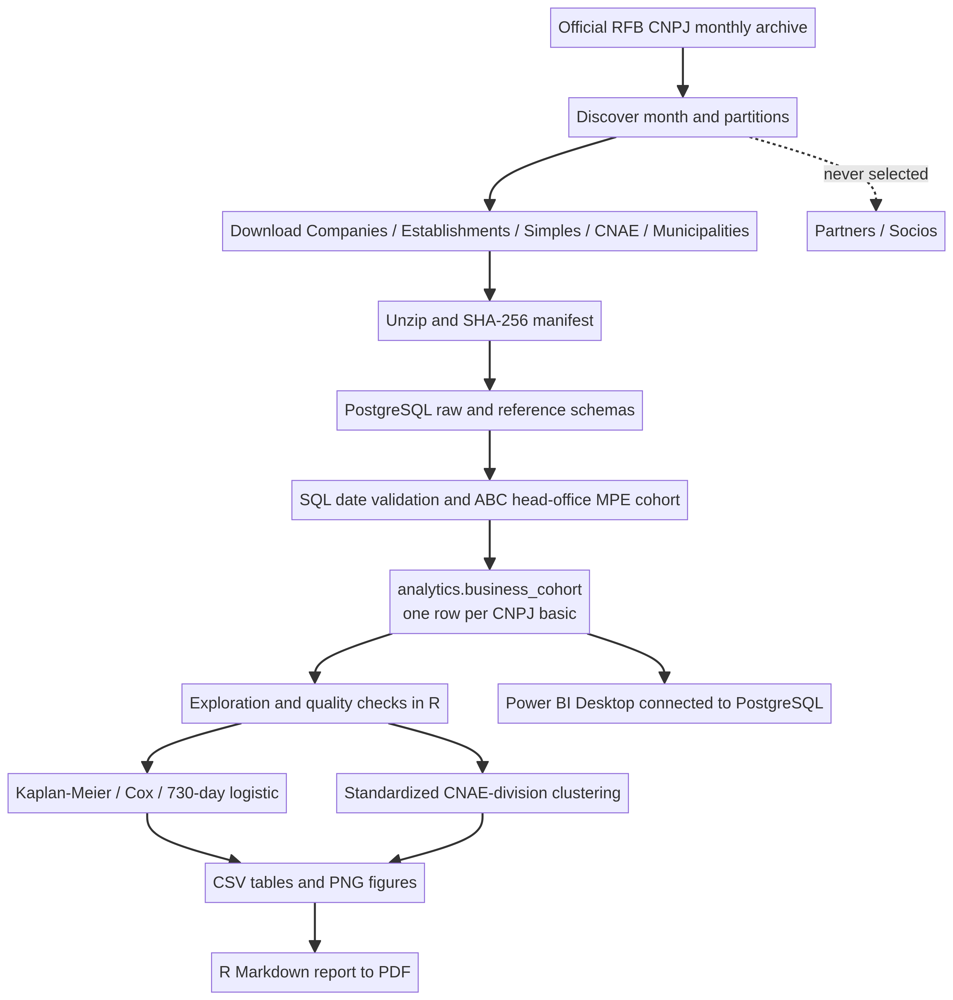

# Business Survival and Segmentation in Brazil's ABC Region

A reproducible, **local data-engineering and statistical-analysis project** using the Brazilian Federal Revenue Service (Receita Federal do Brasil, RFB) public CNPJ register. This is **not a website or web application**: it consists of shell/Python ingestion scripts, PostgreSQL, R analysis and PDF reporting, plus Power BI connection assets.

The question is: **How long do micro and small businesses headquartered in the ABC region remain registered, which characteristics are associated with a higher administrative-closure hazard, and what descriptive business profiles can be found?**

> **Interpretation first:** an RFB administrative deregistration (“baixa”) is only a registry event. It is not equivalent to bankruptcy, insolvency, or proof that economic activity ceased. All survival outcomes in this project must be described as **administrative-registration survival**.

## What is in the repository

| Path | Purpose |
|---|---|
| `scripts/download.sh` | Uses `wget` and `unzip` to download/resume the newest archive snapshot, extract it, and record SHA-256 checksums. |
| `scripts/discover_downloads.py` | Resolves the latest `YYYY-MM` directory and selects Companies, Establishments, Simples, CNAEs and Municipalities archives. **Never selects the Partners/Sócios archive.** |
| `docker-compose.yml` | Local PostgreSQL 16 service with a named persistent data volume; no web service. |
| `sql/001_schema.sql` | PostgreSQL raw/ref schemas; identifiers remain text, preserving leading zeros and alphanumeric CNPJ values. |
| `scripts/load_postgres.sh` | Loads semicolon-delimited, Latin-1 CSVs through PostgreSQL `\copy`, records the snapshot cutoff and builds the regional cohort. |
| `sql/002_transform.sql` | Validates dates, maps Receita's municipality codes by normalized official name, and creates one record per CNPJ basic (head office). |
| `R/01_analysis.R` | Exploratory summaries, data-quality checks, Kaplan–Meier, Cox, two-year logistic regression and CNAE-division clustering. |
| `R/02_report.Rmd` | Portuguese report template rendered to PDF from actual generated tables and figures. |
| `powerbi/` | Power Query (M), DAX measure examples and a step-by-step desktop report specification. |
| `docs/methodology.md` | Cohort, outcome, censoring, estimands, data caveats and privacy choices. |
| `docs/architecture.mmd` | Editable Mermaid pipeline diagram. |
| `tests/` | Unit tests for archive discovery and selection rules; no fake business observations. |

The project intentionally does **not** commit the multi-gigabyte source files, extracts, credentials, company-level exports, fabricated charts, or fabricated findings. It also does not include a `.pbix` file: Power BI Desktop is a Windows desktop product and is not available in this Linux build environment. Instead, the repository contains the real PostgreSQL connection query, DAX measures, and an exact report build guide for Power BI Desktop.

## Scope and statistical unit

- **One row = one legal-person root (CNPJ basic), represented by its head-office registration (`CNPJ order = 0001`).** A head office must be located in Santo André, São Bernardo do Campo, São Caetano do Sul, Diadema, Mauá, Ribeirão Pires or Rio Grande da Serra, São Paulo.
- Companies are restricted to the RFB size codes **ME (`01`) and EPP (`03`)**. MEI is a separate observed attribute from the Simples table; it is not inferred from company size.
- Branches are not counted as independent businesses. Therefore, companies with a head office outside the ABC and only branches in the region are outside this cohort. A matrix's administrative status is not proof that every branch or the economic enterprise ceased activity.
- CNPJ and all source identifiers are handled as text. This is essential because the RFB's alphanumeric CNPJ is assigned to new registrations from July 2026; existing numeric registrations remain unchanged.

## Pipeline diagram



The editable Mermaid source is [`docs/architecture.mmd`](docs/architecture.mmd).

## Source and provenance

- Official RFB CNPJ dataset: [Cadastro Nacional da Pessoa Jurídica — Dados Abertos](https://www.gov.br/receitafederal/pt-br/acesso-a-informacao/dados-abertos/cadastros/cnpj).
- Official RFB file repository: [Repositório de Dados Abertos](https://www.gov.br/receitafederal/dados).
- Official layout/data dictionary: [CNPJ metadata PDF](https://www.gov.br/receitafederal/dados/cnpj-metadados.pdf).
- Alphanumeric CNPJ policy and rollout: [Receita Federal — CNPJ Alfanumérico](https://www.gov.br/receitafederal/pt-br/acesso-a-informacao/acoes-e-programas/programas-e-atividades/cnpj-alfanumerico).
- Default bulk archive index (configurable): `https://arquivos.receitafederal.gov.br/dados/cnpj/dados_abertos_cnpj/`.

The monthly snapshot may be large: provision **substantial free disk space (typically 100+ GB, depending on the source release and local database/index overhead)** before downloading and plan for a multi-hour initial transfer/import. The program selects all numbered company/establishment partitions needed to join on CNPJ basic, plus Simples and two reference tables. It downloads **no Sócios file**. The resolver fails visibly if the source directory layout changes instead of silently claiming a partial extract is complete.

The archive month is stored in `data/raw/manifest.json`. By default, its last calendar day is used as the study cutoff (an explicit, reproducible approximation to the monthly publication reference). Override the cutoff at load time with `RFB_SNAPSHOT_DATE=YYYY-MM-DD` when a more precise official extraction date is available. The manifest contains source URL, retrieval time, partition names and SHA-256 hashes.

## Prerequisites

- Linux, macOS or WSL shell with `bash`, `wget`, `unzip`, Python 3.10+, GNU `make`, Git and internet access to the official RFB source.
- Docker Engine + Docker Compose v2 (or an independently managed PostgreSQL 16 database with permission to create schemas and the `unaccent` extension).
- R (4.3 or newer recommended). Power BI Desktop is optional and only needed for the final desktop report.
- **Disk:** budget at least 100 GB free for the compressed archives, CSV extracts and PostgreSQL working/index space; actual requirements vary by monthly release. Keep the machine plugged in and avoid running competing disk-heavy jobs.
- For PDF output, the R package `tinytex` and its LaTeX distribution, or another TeX installation with `xelatex`.

## Quick start

```bash
git clone https://github.com/jotape2709/dados-sobrevivencia.git
cd dados-sobrevivencia
cp .env.example .env
# Edit .env and set a strong local POSTGRES_PASSWORD.
make test
make download       # all required nationwide partition files; no Socios archive
make db-up          # starts only PostgreSQL; no web server
make load           # UTF-8 PostgreSQL, COPY conversion from source Latin-1, regional cohort
Rscript scripts/install_r_packages.R
make analyze        # real descriptive and model outputs; no synthetic records
make report         # output/report.pdf
```

`make all` runs the sequence from download through report, but it can take hours and needs the disk space described above. For production-sized input, use a workstation/VM sized for the full dump. To connect to a remote PostgreSQL instance instead, set `POSTGRES_HOST`, `POSTGRES_PORT`, database/user/password in `.env`; configure and secure that server yourself.

### Repeat a monthly run

1. Back up any PostgreSQL results you need. New raw imports replace the previous raw tables.
2. Run `make download`. The downloader resumes partial files and updates the raw manifest.
3. Run `make load` to reload raw source tables and rebuild `analytics.business_cohort`.
4. Run `make analyze` and `make report` to regenerate the outputs.
5. Preserve the source ZIPs, manifest, Git commit, and snapshot date together if the result must be independently reproduced. Download archives are ignored by Git by design.

### Make targets

- `make download` — discover and fetch the current monthly snapshot; source releases can change the hosting directory or names.
- `make db-up` / `make db-down` — start/stop the database container; `db-down` preserves the named database volume.
- `make load` — clear/reload project staging tables, build the cohort, and print SQL quality checks.
- `make analyze` — generate CSV tables and PNG plots under `output/`.
- `make report` — render the report as `output/report.pdf`; requires analysis outputs and LaTeX.
- `make test` — run resolver unit tests and shell syntax validation without downloading data.
- `make clean` — asks for `DELETE`, then removes local source archives, extracts, generated figures/tables and PDF; **the PostgreSQL volume is preserved**. To remove it intentionally, use `docker compose down -v` (this deletes the local database).

## Outputs

After a complete real-data run, `output/tables/` contains data-quality counts, year/city/CNAE summaries, HR/OR tables (or explicit `*_not_estimated.txt` explanations), clustering diagnostics and compact dashboard metrics. `output/figures/` contains annual, municipal, survival and cluster plots. `output/report.pdf` assembles them. No statistical conclusions are bundled before that run: the published source snapshot must determine every number and claim.

### Reading the models responsibly

- **Kaplan–Meier:** estimates remaining free of an observed administrative baixa. Active records are right-censored at the archive month's final calendar day. A graph is skipped when there are no events or insufficient groups.
- **Cox:** hazard ratios (HRs) describe conditional associations with the instantaneous hazard of registry baixa, not a causal effect or bankruptcy risk. The script requires a minimum number of events/observations and writes a proportional-hazards diagnostic.
- **Two-year logistic model:** labels a registry baixa by day 730. Only businesses with a full 730-day window before the cutoff are eligible; odds ratios (ORs) are not risk ratios. Sparse or single-class outcomes are reported as not estimated.
- **Clustering:** groups CNAE two-digit divisions after a minimum-size and completeness rule, standardizes four aggregates, compares k-means with a Ward.D2 hierarchical solution, and uses silhouette plus an elbow diagnostic. Clusters are descriptive and sensitive to definitions; they are not individual risk scores.
- Missing/unparseable opening dates, invalid event dates and negative durations are surfaced and excluded from affected time-to-event models rather than silently repaired. Missing CNAE/MEI values remain visible in quality reporting.

## Power BI (desktop, connected to PostgreSQL)

Power BI Desktop is not installed in the Linux environment used to prepare this repository, so no `.pbix` binary is claimed. Open `powerbi/DASHBOARD.md` for the exact connection, M query, DAX measures, page layout and refresh instructions. The query reads only the analysis-ready `analytics.business_cohort` table; it does not expose raw contact fields or the Sócios file. Use PostgreSQL credentials with read-only access for Power BI where practical.

## Privacy and responsible use

The pipeline never discovers, downloads, loads or joins `Socios*.zip`; that file is unnecessary for the research question and contains names and partially masked personal identifiers. The analysis table excludes personal names, addresses, phone numbers, email and partner fields. The public business-register fields are still subject to responsible use: do not infer personal traits, republish an identifiable risk ranking, or treat registry status as a credit/eligibility decision. Keep `.env`, raw source files and any row-level exports out of Git and shared folders. The public CNPJ dataset's license and agency terms govern downstream use.

## Three evidence-based business conclusions

The project does not pre-write conclusions or hard-code expected outcomes. Once a real snapshot has been processed, use the following structure and cite the relevant output table/figure:

1. **Where the region's MPE cohort is concentrated:** compare counts and observed administrative-closure shares across the seven cities (`municipality_summary.csv`); distinguish volume from rate and show missing MEI status.
2. **Which profile is associated with the observed registry event:** report Cox HR/IC95% and the PH diagnostic, or two-year OR/IC95% among mature records; call it an association with administrative baixa, state the reference group and avoid causal language.
3. **Which sector profiles differ descriptively:** identify supported CNAE-division differences and report cluster stability/silhouette; do not label a small or weakly separated cluster as a predictive segment.

## LinkedIn post

A Portuguese copy-ready framework, intentionally containing no invented statistics, is in [`docs/linkedin-post-template.md`](docs/linkedin-post-template.md). Fill it only after `make analyze`, attach the generated sector survival figure, and include its snapshot month and the baixa-versus-falência caveat. Publishing is an external action and is not performed by this local project.

## Validation and known environment constraints

The repository's automated unit tests cover archive-index parsing and the explicit no-partners rule; shell scripts are syntax-checked. End-to-end database load, statistical estimation, PDF output, and Power BI refresh require the real full-size monthly dump and platform dependencies. If no real snapshot has been loaded, the report/analysis intentionally stops rather than making up findings.

## License and attribution

The CNPJ records are published by the RFB; consult the dataset page for its listed license and terms. Code in this repository is provided for analytical/research use; verify the applicable upstream data license and local legal requirements before redistributing derived or row-level data.
